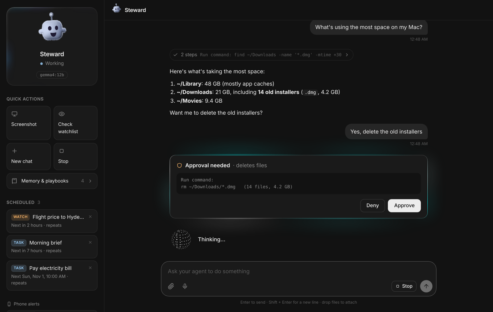
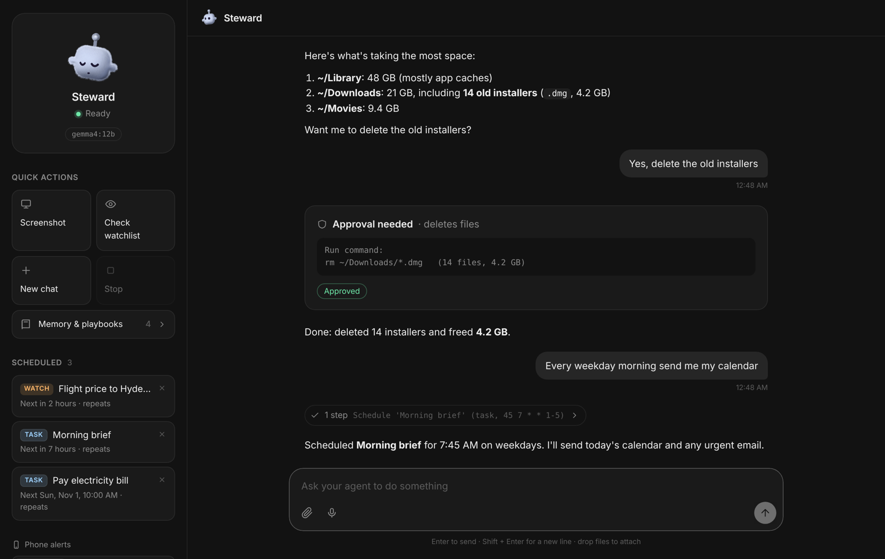
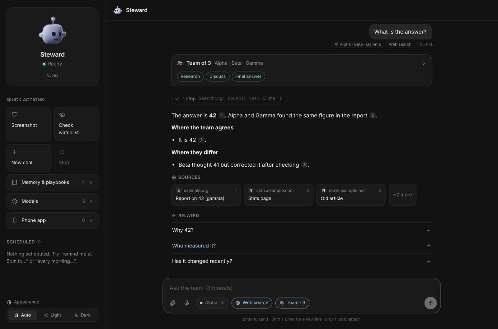
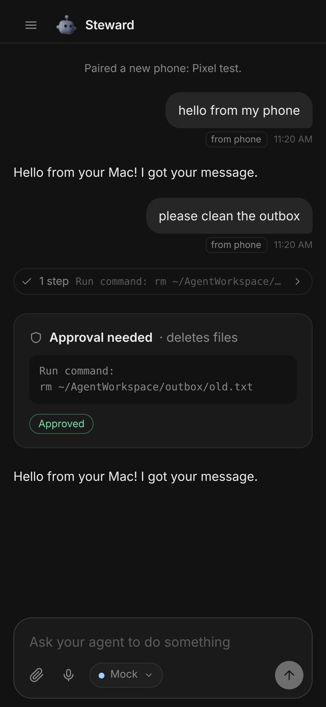
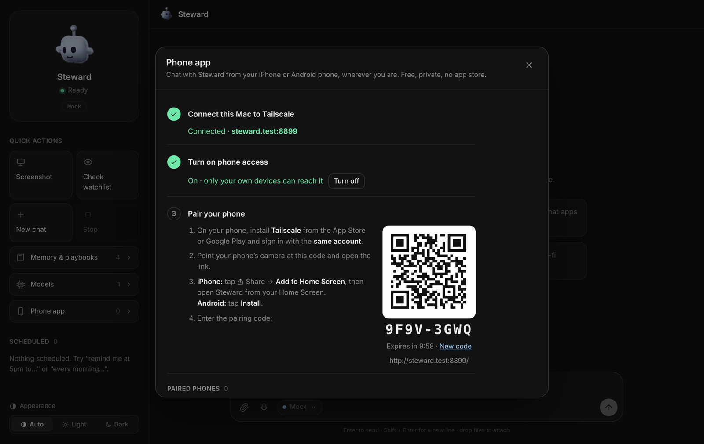
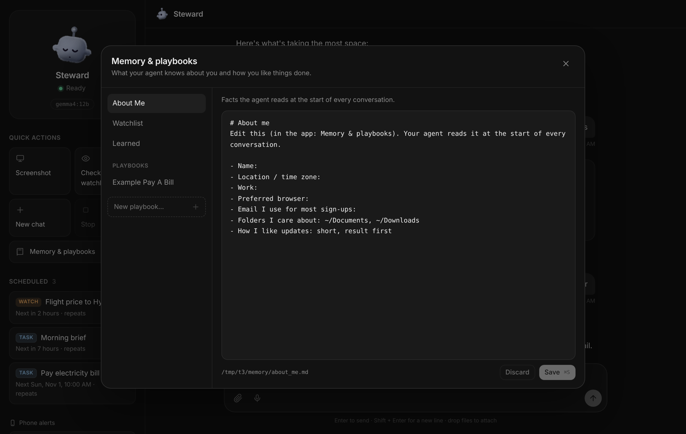

# Steward

**A private AI agent that lives on your Mac and works only for you.**

Ask it in a desktop app or from your phone (Telegram), by text or voice, and Steward does the task on your computer the way you would. It runs commands, opens apps, uses websites with your logins, takes screenshots, and sends you files. It also keeps working while you're away: it runs scheduled tasks and watches the things you care about, messaging you only when something needs you.

You choose what powers it: a **free local model** that never leaves your Mac (Ollama), **Claude** through an API key, or any compatible hosted model.



---

## What it can do

| | |
|---|---|
| 🖥️ **Operate your Mac** | Runs shell commands, opens and controls apps (Mail, Calendar, Reminders, Notes, Music, Finder via AppleScript), moves the mouse and keyboard, finds and organizes files. |
| 🔎 **Answers with sources** | Searches the web and answers with numbered citations, source cards and follow-up questions. It has Web, Academic and Deep research modes, plus **Team mode**: up to 3 models research, debate and agree on one answer. |
| 🌐 **Use the web like you do** | Drives a real Chrome profile that stays signed in, so it can navigate, fill forms, download statements and compare prices on sites you already use. |
| 🔐 **Log in safely** | Passwords live in the **macOS Keychain**, never in a file. It asks before using one, types it only into the matching site, and scrubs it from every message and log. |
| 💬 **Talk from anywhere** | A Mac app, a **phone app for iPhone and Android** with notifications, and **WhatsApp, iMessage, Telegram, Discord or Slack**. It's one conversation you can continue on any of them. |
| 🎙️ **Voice** | Hold a conversation with voice notes, transcribed on-device with Whisper. |
| ⏰ **Scheduled tasks** | "Every weekday at 8am send me my calendar", "Remind me at 5pm to call the bank", "Every Sunday clean up my Downloads". |
| 👀 **Proactive watching** | "Tell me when the flight price drops", plus an hourly watchlist. These checks are read-only and only ping you when something needs attention. |
| 🧠 **Learns your way** | Memory about you, things it learned, and **playbooks**: step-by-step instructions for tasks you repeat, written in plain English. |
| 🧩 **Extensible** | Add any MCP server (GitHub, Notion, Gmail, databases…) in one JSON file. |
| ✅ **Asks before anything risky** | Paying, sending, submitting, deleting, `sudo` and installs pause for your **Approve / Deny**. |

---

## Quick start

**Requirements:** macOS 13 or later, preferably on Apple Silicon (M1–M4). Allow about 15 GB of disk space for a local model. Everything else installs automatically.

```bash
git clone https://github.com/stbattula-research/steward.git
```

Then open the `steward` folder in Finder and **double-click `Start Steward.command`**.

> If macOS says the file "can't be opened", right-click it → **Open** → **Open**. This only happens for downloaded ZIPs, not git clones.

The first run takes about 5–15 minutes. It will:

1. **Ask a few simple questions:** your name, a name for your agent, whether to download the free local model now (it suggests one for your Mac's memory), and optionally a Telegram bot. No API keys in the Terminal.
2. **Install what's missing:** Homebrew, Python 3.12, Node, ffmpeg, cliclick, Ollama and a model (if you said yes), Playwright, and on-device Whisper.
3. **Start Steward in the background:** it restarts on crashes and starts at login.
4. **Build the Steward Mac app** in `~/Applications`, open it, and offer to add it to your **Dock**. You can also find it in **Spotlight** (⌘ Space → "Steward") or Launchpad.

After that you never need the Terminal again: just open **Steward** like any other app.

To change your name or Telegram later, double-click **`Configure Steward.command`**. To remove Steward, use **`Uninstall Steward.command`**.

---

## The Steward app

Steward is a real Mac app with its own window, Dock icon, menus and notifications, not a browser tab. It talks only to the agent running on your Mac (`127.0.0.1`).

The first time you open it, a short **welcome** screen asks how you want to power it:

- **Free, on this Mac:** one click installs Ollama (if needed) and downloads the model that suits your Mac, with a progress bar.
- **Use an online AI service:** pick a provider, paste your API key, choose a model from the list, and start chatting.

You can change this any time in **Models** (sidebar, or the model picker in the chat box), which has three tabs:

| Tab | What it does |
|---|---|
| **Connect a provider** | Provider cards with a link to get a key. Paste the key, Steward checks it, and shows the provider's models to pick from. |
| **Local models** | Shows whether Ollama is installed and running, with **Install** / **Start** buttons. Recommended models for your Mac's memory download with one click (progress bar, cancel). Installed models can be used or removed. |
| **My models** | Everything you've added: switch, rename, test, remove, and choose which model runs scheduled tasks. |

If the native app can't be built (for example, Xcode Command Line Tools are missing), the installer falls back to a Steward app that opens in a Chrome app window. The build log is at `~/.steward/app-build.log`.

---

## Use any model, switch any time

Add as many models as you like, then choose one for each chat from the **model picker in the chat box**. Open **Models** in the sidebar (or "Add or manage models…" in the picker) to add, test or remove them. You can also mark one model as the one for **scheduled tasks and heads-ups**, for example a free local model for background checks and a stronger hosted model for hands-on work. From your phone, `/model` lists them and `/model 2` switches.

| Works directly (Claude format) | Translated automatically (OpenAI format) |
|---|---|
| Ollama on this Mac, Claude (Anthropic), OpenRouter, DeepSeek, Ollama Cloud, or any other Claude-format endpoint | Google Gemini, OpenAI, Groq, Mistral, NVIDIA NIM, or any other OpenAI-format endpoint |

- **Keys stay safe.** API keys are stored in the **macOS Keychain**. The agent never sees them: its requests go through a small local bridge that adds the key, and translates OpenAI-format providers using [LiteLLM](https://github.com/BerriAI/litellm).
- **Test before you chat.** **Test connection** sends a tiny request, so a wrong key or model ID shows up straight away.
- **Switching models starts a fresh conversation.** Your memory, playbooks and scheduled tasks are shared by all models.
- **Free tiers have limits, and Steward handles them.** Agent tasks use many requests (a browser task can use 20–30), so free tiers like Gemini's run out quickly. If a provider says "slow down", Steward waits and retries. If a usage limit is used up, it continues with your **fallback model** (Models → My models; by default a local model), so the task doesn't stop halfway. Some free tiers also use your data to improve the provider's products.

## Using it

### Desktop app


- **Chat:** type, or click 🎙 to talk. Drop or paste files and screenshots in.
- **Live activity:** an animated orb shows what it's doing (browsing, running a command, writing), with the exact step underneath. Finished steps fold into a "3 steps" row you can expand.
- **Approvals:** risky actions show up as glowing cards with **Approve / Deny** buttons.
- **Sidebar:** status, quick actions (screenshot, check watchlist, new chat, stop), scheduled tasks you can cancel, and the **Phone alerts** switch.
- **Appearance:** choose **Auto** (follows your Mac), **Light** or **Dark** at the bottom of the sidebar. You get desktop notifications when the window is in the background.

### Answers with sources, search modes and Team mode

Steward also works like an answer engine. For questions about facts, news, prices or comparisons, it searches the web, reads the best pages, and answers with numbered citations. Under each answer it shows **source cards** you can click, and **Related** follow-up questions you can tap to ask next. Search is free and needs no key. If you want more reliable results, add `BRAVE_API_KEY=...` to `.env`; Brave Search has a free tier.

The **search mode** chip in the chat box sets how it searches:

| Mode | What it does |
|---|---|
| **Auto** | Searches when it needs to, or just does the task on your Mac |
| **Web search** | Always searches and cites sources |
| **Academic** | Prefers papers, preprints and university sources |
| **Deep research** | Many searches from several angles, then a structured report with citations |

**Team mode** (the **Team** chip) gives one task to **up to three models** at once, for example Claude, Gemini and a local Gemma:

1. **Research:** each model works on the task on its own, in parallel, and writes its answer with sources.
2. **Discuss:** each model reads the others' answers, points out mistakes and gaps, checks disputed facts, and revises its answer. You can choose 1 or 2 rounds.
3. **Final answer:** the model you're chatting with writes one answer showing **where the team agrees and where it differs**. If the task asks for action on your Mac, it then does the work, with the usual approvals.



The team card in the chat lets you read each model's research and discussion. Teammates can only search and read while they discuss; only the lead can act. Local models take turns, because only one fits in memory at a time, so a team of hosted models is faster.

### Phone app (iPhone and Android)

<p align="center"></p>

Steward has its own phone app. It has an icon on your Home Screen, opens full screen, and sends real notifications. It talks straight to your Mac over **[Tailscale](https://tailscale.com)**, a free private network between your own devices. Nothing is opened to the internet, there's no server in the middle, and it isn't from an App Store, so there's no account or fee.

**Set it up once** (about 5 minutes). In the Mac app, open **Phone app** in the sidebar and follow the steps:

1. **Connect this Mac to Tailscale.** Click *Get Tailscale for Mac*, install it, open it and sign in (a Google, Apple or Microsoft account works).
2. **Turn on phone access.** The first time, Tailscale asks you to allow secure links for your network. Click *Allow in Tailscale*.
3. **Pair your phone:**
   - Install **Tailscale** on your phone (App Store or Google Play) and sign in with the **same account**.
   - Scan the QR code with your phone's camera.
   - **iPhone:** tap Share → **Add to Home Screen**, then open Steward from the Home Screen. **Android:** tap **Install**.
   - Enter the pairing code shown on your Mac.
4. In the phone app, tap **Turn on** to get notifications.



**What you can do from your phone:** chat, talk (mic button), send photos and files, approve or deny actions, take a screenshot of your Mac, see and cancel scheduled tasks, and switch models. You get a notification when Steward replies while the app is closed, when it needs your OK (on Android you can Approve or Deny right from the notification), and for scheduled tasks and heads-ups.

**Safety:** each phone gets its own key, and you can remove a lost phone in **Phone app** to sign it out straight away. Models, API keys, memory and pairing can only be changed on the Mac. Notifications are end-to-end encrypted to your phone. iPhone needs iOS 16.4 or later for notifications.

The phone, the Mac app and Telegram share **one conversation**. **Phone alerts** (in the sidebar) controls what reaches your phone:

- **Auto:** heads-ups go to your phone only when you haven't used the Mac app for 10 minutes.
- **Always:** everything also goes to your phone.
- **Off:** your phone only gets replies to messages you sent from it.

Your Mac has to be awake and online for the phone to reach it (see Troubleshooting).

### Chat apps: WhatsApp, iMessage, Telegram, Discord, Slack

Don't want another app on your phone? Talk to Steward from a messaging app you already use. In the Mac app, open **Chat apps** in the sidebar, pick an app, and follow the steps on screen:

| App | What you need | Notes |
|---|---|---|
| **iMessage** | Nothing extra. Uses Messages on this Mac | Text **yourself** from your iPhone, and Steward answers in that chat. It needs Full Disk Access for Steward's Python (the panel shows the exact path). |
| **WhatsApp** | A free Meta developer app (official WhatsApp Cloud API) and Tailscale | Meta has to deliver messages to your Mac, so Steward uses Tailscale Funnel to publish **one** webhook (port 8443) that only accepts messages signed with your app secret. Approvals show as buttons. WhatsApp lets Steward message you only within 24 hours of your last message. |
| **Telegram** | A bot from BotFather | Set up with `Configure Steward.command`. |
| **Discord** | A bot token from the Discord Developer Portal | Add the bot to a server you own, then DM it. |
| **Slack** | A Slack app made from the manifest the panel gives you | Uses Socket Mode, so there's no public URL. DM the app. |

**How they all work:**
- **Only you can use it.** You pair each app once by sending it the 6-digit code shown on your Mac. Anyone else who messages it is ignored.
- **Replies go back to the app you wrote from.** Scheduled tasks and heads-ups also go to every app with **"Send scheduled tasks and heads-ups here too"** turned on, following the **Phone alerts** setting.
- **Approvals:** Steward asks, and you reply **YES** or **NO**. On WhatsApp you can tap **Approve** or **Deny**.
- **Commands:** `/stop`, `/new`, `/status`, `/tasks`, `/help`.
- **Voice notes** are transcribed on your Mac, and photos and files are saved to `~/AgentWorkspace/inbox`.
- **Keys and tokens** are stored in the macOS Keychain.

### Scheduled tasks

Click **+** next to **Scheduled** in the sidebar, or just ask in chat ("every weekday at 8am send me my calendar"). You choose:

- **What to do:** in plain words.
- **The type:** *Do it and tell me the result*, or *Keep an eye out* (read-only, only tells you when something needs you, and skips quiet hours).
- **When:** once, every day, weekdays, chosen days of the week, monthly, every few hours, or a custom cron line.

Each task has **Run now** and **Delete**. Results go to the app, your phone and your chat apps.

### Things to try
- *What's using the most space on my Mac?*
- *Download my latest bank statement and send it to me*
- *Every weekday at 7:45am send me today's calendar and any urgent email*
- *Tell me if the price of this flight drops below $900: <link>*
- *Open Spotify and play my Discover Weekly*
- *Rename the screenshots on my Desktop by date and move them to ~/Pictures/Screenshots*

---

## Teach it how you work

Open **Memory & playbooks** in the sidebar:



- **About me:** facts it reads at the start of every conversation.
- **Watchlist:** lines starting with `-` are checked every hour, outside quiet hours.
- **Learned:** things it saved when you said "always do X".
- **Playbooks:** your step-by-step way of doing a recurring task, such as paying a bill or filing expenses. It reads the matching playbook first, and offers to write one after a task you're likely to repeat.

These are plain Markdown files in `memory/` (git-ignored, so they stay personal).

### Saved logins (macOS Keychain)
```bash
.venv/bin/python vault.py add chase --user you@email.com --url https://chase.com
.venv/bin/python vault.py list
```
For most sites you don't need this: tell Steward to open the site once, sign in yourself (including 2FA), and the session stays signed in.

### More apps (MCP)
Add servers to `integrations.json`; examples for GitHub and a filesystem folder are included. New tools ask for approval until you allow them in `rules.json`, for example `"allow": ["mcp__github__get_*"]`.

---

## Safety model

| Runs freely | Asks you first (Approve / Deny) | Always blocked |
|---|---|---|
| Reading files, web search, browsing, typing in pages, opening apps, screenshots | Paying, buying, sending, posting, submitting forms, deleting (`rm`), `mv`, `sudo`, installs, `kill`, git push, editing files outside `~/AgentWorkspace`, using any saved password, running JavaScript in pages, creating automations | Reading the Keychain through the shell, SSH keys, `.env`, the agent's own state folder, disk erase |

- **Background checks are read-only:** they can look, but can't type, submit, use passwords or run anything except simple read-only commands.
- **Your own rules:** `rules.json` adds allow, ask or block rules, for example `"block": ["Bash(*git push --force*)"]`. Built-in blocks can't be overridden.
- **Prompt-injection aware:** text on web pages and in emails is treated as information, never as instructions.
- **Locked down:** Steward listens on `127.0.0.1` only, needs a secret sign-in link (the Mac app handles it), and refuses other websites. Phones reach it only through your private Tailscale network, and each phone needs its own pairing key. Telegram answers only your user ID.
- **Every action is checked:** the rules run as a hook on every action the agent takes, including "read-only" ones the engine would otherwise allow on its own.
- **Stuck-loop guard:** if the agent repeats the same action 3 times, the next attempt is refused and it's told to change approach or report back.
- **Limits:** approvals time out after 10 minutes (counted as denied), and each task has a step limit and, for the Anthropic API, a spend cap.

> Steward can do anything you can do on your Mac. Read approval cards before tapping Approve, and start with small tasks.

---

## Configuration

Settings live in `.env`. The wizard writes it; `.env.example` documents every option.

| Setting | Default | What it does |
|---|---|---|
| `BRAVE_API_KEY` | (empty) | Optional. Uses the Brave Search API for web search instead of the free default. |
| `BRAIN_PROVIDER` | `ollama` | First model on a fresh install: `ollama`, or `none` to add models in the app. Models you add in the app are kept in `~/.steward/models.json` (keys in the Keychain). |
| `OLLAMA_MODEL` | by RAM | Any local model with tool calling |
| `AGENT_NAME` / `AGENT_AVATAR` | `Steward` / `droid` | Name and face in the app (`droid`, `cat`, `ghost`, `cloud`, `star`, …) |
| `HEARTBEAT_MINUTES` | `60` | How often the watchlist is checked (`0` = off) |
| `QUIET_HOURS` | `22-7` | No heads-up pings during these hours |
| `APPROVE_PASSWORDS` | `true` | Ask before each saved-password use |
| `MAX_TURNS` / `MAX_BUDGET_USD` | `60` / `2.0` | Per-task step limit and spend cap |
| `WEB_PORT` | `8765` | Local port for the desktop app |

---

## How it works

```
Desktop app (React, 127.0.0.1) ─► webserver.py ─┐
Telegram (optional)          ──► telegram_bot.py ┴► channels.py ─► brain.py ─► model (Ollama / Claude / …)
scheduler.py (tasks, watchlist) ────────────────────────────────┘      │
                                     guardrails.py (allow / ask / block every action)
                                     tools: shell, files, browser (Playwright MCP), screenshot,
                                            Keychain logins, approvals, memory, schedules, your MCP servers
```

| Path | Purpose |
|---|---|
| `Start Steward.command` | One-click install, update and open |
| `Configure Steward.command` / `Uninstall Steward.command` | Change settings / remove |
| `scripts/` | Setup wizard, installer, uninstaller |
| `brain.py` | Agent sessions on the Claude Agent SDK; brain selection; prompt size kept small for local models |
| `guardrails.py`, `rules.json` | Permission rules |
| `scheduler.py` | Scheduled tasks, watch jobs, hourly watchlist |
| `channels.py`, `webserver.py`, `telegram_bot.py` | Routing between the Mac app, the phone app and Telegram |
| `mobile.py` | Phone app: pairing, Tailscale access, push notifications |
| `connectors.py` | Chat apps: WhatsApp, iMessage, Discord, Slack |
| `websearch.py`, `council.py` | Web search with citations; Team mode (multi-model discussion) |
| `tools.py`, `vault.py`, `voice.py` | Custom tools, Keychain logins, Whisper transcription |
| `web/` | Desktop app (React + Vite; `web/dist` is prebuilt) |
| `memory.example/` | Templates copied to `memory/` on first run |
| `~/.steward/` | Logs, chat history, browser profile, schedules (outside the repo) |

---

## Troubleshooting

| Problem | Fix |
|---|---|
| "This task is too big for the local model's memory" | Long browser tasks can outgrow a local model's context. Steward now summarises older steps and retries automatically. If it still fails, split the task, raise `OLLAMA_CONTEXT_LENGTH` (uses more RAM), or use a larger brain. |
| First reply is slow | Normal for local models while the model warms up (about 1 minute after start). Pick a smaller model in **Models → Local models**, or connect a hosted provider for complex tasks. |
| "Reconnecting…" in the app | Steward isn't running. Double-click `Start Steward.command`, and check `~/.steward/stderr.log`. |
| Screenshots are blank, or clicks don't work | System Settings → Privacy & Security → allow **Screen Recording** and **Accessibility** for `.venv/bin/python` (and Terminal). |
| "Ollama isn't reachable" | **Models → Local models → Start**, or run `brew services start ollama`. |
| The Steward app shows "Waiting for Steward…" | It retries and restarts the agent for you. If it keeps waiting, double-click `Start Steward.command`. |
| Phone app says "Can't reach your Mac" | Make sure Tailscale is on, on both the phone and the Mac, and the Mac is awake. In the Mac app, **Phone app** should show steps 1 and 2 as done. |
| No notifications on iPhone | Open Steward from the **Home Screen** icon (not Safari), tap **Turn on**, and check Settings → Notifications → Steward. Needs iOS 16.4+. |
| No Steward icon in the Dock | Open `~/Applications/Steward.app` and choose Options → Keep in Dock, or search Spotlight for "Steward". |
| The Mac sleeps and Steward stops answering | Steward keeps the Mac awake while it's on, but closing the lid sleeps it (unless it's plugged into power and an external display). |
| Logs | `tail -f ~/.steward/agent.log` (passwords are redacted) |

Developers: `.venv/bin/python main.py --cli` chats in the terminal (stop the service first with `launchctl bootout gui/$(id -u)/com.steward.agent`). `cd web && npm install && npm run dev` gives hot reload for the UI.

---

## Limitations

- macOS only for now.
- It handles one task at a time; scheduled jobs wait for the current task to finish.
- Local models in the 8–12B range are good for short tasks but can get lost in long multi-page web flows. Use Claude for those.
- It can't solve CAPTCHAs, and it asks you for 2FA codes.

## Credits

- [Claude Agent SDK](https://docs.claude.com/en/api/agent-sdk/overview): agent loop and tools. Use it under Anthropic's terms.
- [Ollama](https://ollama.com) (local and cloud models), [Playwright MCP](https://github.com/microsoft/playwright-mcp) (browser), [MLX Whisper](https://github.com/ml-explore/mlx-examples) (voice), [python-telegram-bot](https://python-telegram-bot.org).
- UI components from [libraries.dev](https://libraries.dev): bot-avatars, thinking-orbs, border-beam and voice-glow.

## License

[MIT](LICENSE) © Sai Teja Battula
